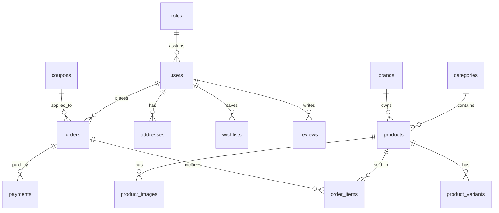

# Phase 3 — Database

**Status:** Complete  
**Date:** July 23, 2026

## Overview

ShopQ database `shopq_database` is normalized (3NF), indexed, and seeded with **50 products**, **150 images**, **89 color variants**, **10 categories**, and demo users.

## Entity Relationship (High Level)



## Tables Created (32)

| Group | Tables |
|-------|--------|
| Auth | `roles`, `users` |
| Catalog | `categories`, `brands`, `products`, `product_images`, `product_variants`, `product_tags`, `product_tag_map` |
| Commerce | `carts`, `cart_items`, `wishlists`, `compare_items`, `coupons`, `orders`, `order_items`, `order_status_history`, `payments` |
| Marketing | `banners`, `offers`, `flash_sales`, `flash_sale_products` |
| Customer | `addresses`, `reviews`, `wallets`, `wallet_transactions`, `memberships`, `user_memberships`, `notifications` |
| Analytics | `product_views`, `search_logs` |
| System | `settings`, `activity_logs` |

## Design Decisions

| Decision | Reason |
|----------|--------|
| `order_items` stores price snapshot | Product prices can change; orders must stay accurate |
| `deleted_at` on products (soft delete) | Preserve order history integrity |
| Separate `product_variants` | Color-specific stock and price adjustments |
| `payments.gateway_response` as JSON | Ready for Razorpay payload storage |
| Seed via PHP for products | Maintainable 50-product catalog with variants |

## Setup Commands

```bash
# Normal setup (safe, idempotent)
C:\xampp\php\php.exe database/setup.php

# Fresh install (drops entire database first)
C:\xampp\php\php.exe database/setup.php --fresh
```

## Seed Accounts

| Role | Email | Password |
|------|-------|----------|
| Super Admin | superadmin@shopq.local | Admin@123 |
| Admin | admin@shopq.local | Admin@123 |
| Customer | customer@shopq.local | Admin@123 |

## Verification Queries

```sql
USE shopq_database;
SELECT COUNT(*) FROM products;          -- 50
SELECT COUNT(*) FROM product_variants;  -- ~89
SELECT COUNT(*) FROM product_images;    -- 150
SELECT COUNT(*) FROM categories;        -- 10
```

## Next Phase

**Phase 4 — Authentication:** Register, login, logout, RBAC, CSRF-protected forms, session security.
